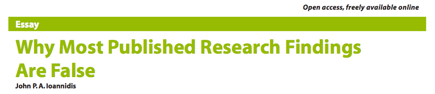

---
# YAML metadata
title: Introducing R for data analysis
author: Matthew Brett
linkcolor: blue
urlcolor: blue
bibliography: data.bib
<#ifndef HANDOUT>
suppress-bibliography: true
<#endif>
---

# Before we start

* Go to the link in the Zoom chat
  <https://uobhub.org/hub/user-redirect/git-pull?repo=https%3A%2F%2Fgithub.com%2Fmatthew-brett%2Fclear-easy&urlpath=/rstudio>
* There will be a live Zoom / Ask Me at 10 a.m. on Tuesday 6th Oct with Drs
  Steve Unwin & Roisin Madigan covering Second Year and Bio240.  It’s not on
  your timetable, because it's a one-off. 

# Why R?

* What is R?
* Why are we teaching you R?

# Mid-revolution

You are in the middle of a huge shift in scientific education and practice:

* data analysis (called data science [@davenport2012data]);
* statistics (with resampling) [@simon1997resampling; @chihara2012mathematical;
  @cobb2007introductory];
* collaboration (reproducibility).

# In the past we...

* Worked really hard to avoid writing any code
* Taught you statistics by recipe

# That doesn't work any more because

* It turns out that for anything more than slightly complicated, it's easier to
  learn code and do the analysis, than do the analysis without code.
* Modern data is really, really big, and really, really complicated.
* Much of your life now comes from code applied to data.
* Analysis by GUI and learning statistics by recipe is causing a tsunami of bad
  statistics and wrong results.

# Who is learning this?

*   understand what algorithms are, how they are implemented as
    programs on digital devices, and that programs execute by
    following precise and unambiguous instructions;
*   create and debug simple programs;
*   use logical reasoning to predict the behaviour of simple programs
*   use technology purposefully to create, organise, store, manipulate
    and retrieve digital content

# This who!

*   understand what algorithms are, how they are implemented as
    programs on digital devices, and that programs execute by
    following precise and unambiguous instructions;
*   create and debug simple programs;
*   use logical reasoning to predict the behaviour of simple programs
*   use technology purposefully to create, organise, store, manipulate
    and retrieve digital content

[National curriculum in
computing](https://www.gov.uk/government/publications/national-curriculum-in-england-computing-programmes-of-study/national-curriculum-in-england-computing-programmes-of-study):
Key stage 1 (5-7 year olds).

# So ... R

* Expressing data analysis with code.
* Can do virtually any analysis task in geography, environmental science.
* The right tool for complicated data.

# Excel, complicated, game over

{width=100%}

# Engagement with modern data

{height=70%}

# Data in society

Algorithms for sentencing are biased against black offenders.

Full analysis at https://github.com/propublica/compas-analysis

# You've got to be really careful to avoid being wrong

> The scientific method's central motivation is the ubiquity of error - the
> awareness that mistakes and self-delusion can creep in absolutely anywhere
> and that the scientist's effort is primarily expended in recognizing and
> rooting out error."

[@donoho2009reproducible]

# Begley and Ellis 2012

Scientists at Amgen (a drug company) tried to reproduce findings from 53
"landmark" studies.

> ... when findings could not be reproduced, an attempt was made to contact
> the original authors, discuss the discrepant findings, exchange reagents and
> repeat experiments under the authors’ direction, occasionally even in the
> laboratory of the original investigator.

Of 53 studies, only 6 replicated (11%).

[@begley2012drug]

# Many published papers are probably wrong

\

See [@ioannidis2005most] and [this tutorial
walkthrough](http://matthew-brett.github.io/teaching/ioannidis_2005.html).

# What is R?

* [The base R language](https://www.r-project.org)
* [R Studio](https://www.rstudio.com)
* [The R Notebook](https://bookdown.org/yihui/rmarkdown/notebook.html)

# Getting help in R

* The R and R studio interface.
* Your search engine.
* Your colleagues.
* Your TAs.

# The end of the beginning

To the cloud!

<#ifdef HANDOUT>
# References
<#endif>
